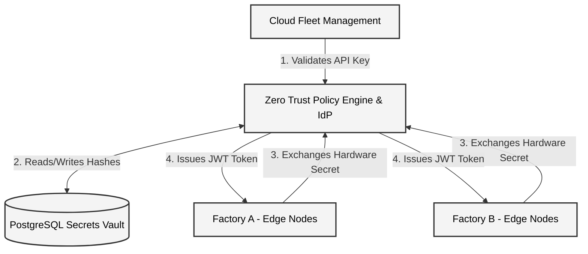
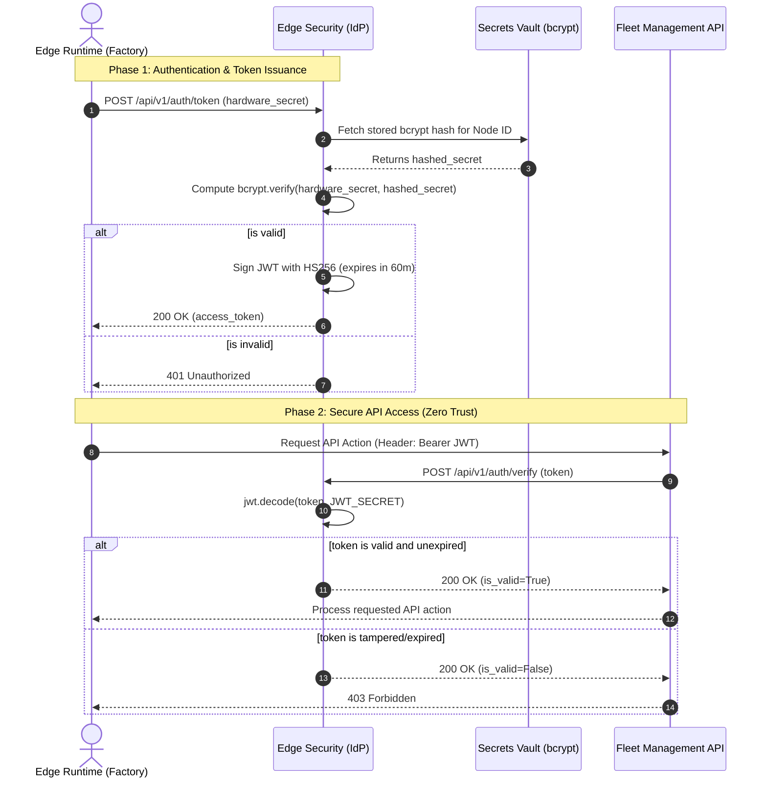

# Edge Security Architecture

The Edge Security repository is the foundation of trust across the entire AI Ecosystem. Because physical factories and edge nodes operate outside of secure cloud perimeters, the system mandates a **Zero Trust Architecture (ZTA)**. No device, API, or service is inherently trusted; every interaction must be cryptographically verified.

---

## High-Level Design (HLD)

This diagram visualizes how the centralized Zero Trust Policy Engine acts as the absolute mediator between Cloud Fleet Management services and the physical Edge Nodes. 

The `edge-security` API issues highly secure mTLS certificates and JSON Web Tokens (JWTs) that allow nodes to authenticate against cloud control planes.

### HLD Component Details
1. **Zero Trust Policy Engine & IdP (FastAPI)**: The highly-available API layer. It acts as the Identity Provider (IdP) for hardware devices and the Policy Decision Point (PDP) for internal cloud APIs.
2. **PostgreSQL Secrets Vault**: Securely stores Edge Node identities and Cloud API keys using strict `bcrypt` hashing algorithms. Plaintext secrets are never stored.
3. **Cloud Fleet Management**: The internal administration APIs (such as `edge-management`). They utilize long-lived API Keys to interface with the security engine.
4. **Edge Nodes**: The physical hardware devices running inference and agent loops. They use burned-in hardware secrets to request short-lived JWTs.

---

## Low-Level Design (LLD)

This sequence diagram details the exact cryptographic and database flow that occurs when an Edge Node boots up on the factory floor and attempts to communicate with the Cloud Fleet API.

### LLD Execution Flow Details

1. **Hardware Secret Exchange**: When the physical node initializes, it sends its immutable hardware secret to the `/auth/token` endpoint. 
2. **Hash Verification**: The security engine pulls the associated `bcrypt` hash from the database. This guarantees that even if the database is compromised, the plaintext hardware secrets remain safe. The system computes a cryptographically secure hash comparison.
3. **JWT Signing**: If the secret matches, the engine constructs a JSON Web Token (JWT) with the node's Identity and Role encoded in the payload. It signs this payload using the highly classified `JWT_SECRET` string. The token is explicitly restricted to a 60-minute lifespan (`ACCESS_TOKEN_EXPIRE_MINUTES`).
4. **Zero Trust Verification**: Later, when the Edge Node attempts to interact with the Fleet Management API, it attaches the JWT as a Bearer token. The Fleet API inherently distrusts the token and immediately forwards it to the Security Engine's `/auth/verify` endpoint. The Security Engine cryptographically verifies the HS256 signature to guarantee the token hasn't been tampered with or expired before authorizing the action.
